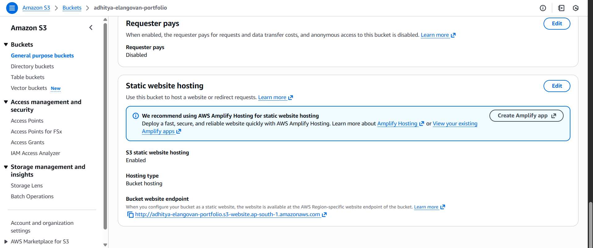
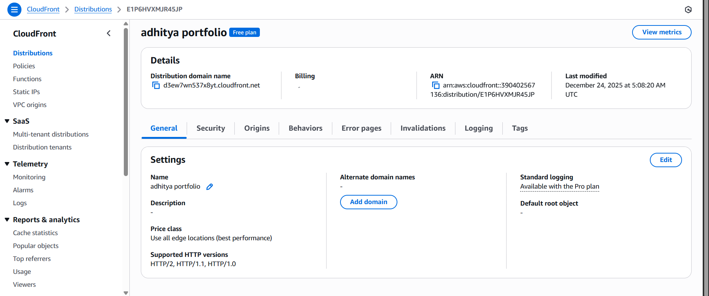
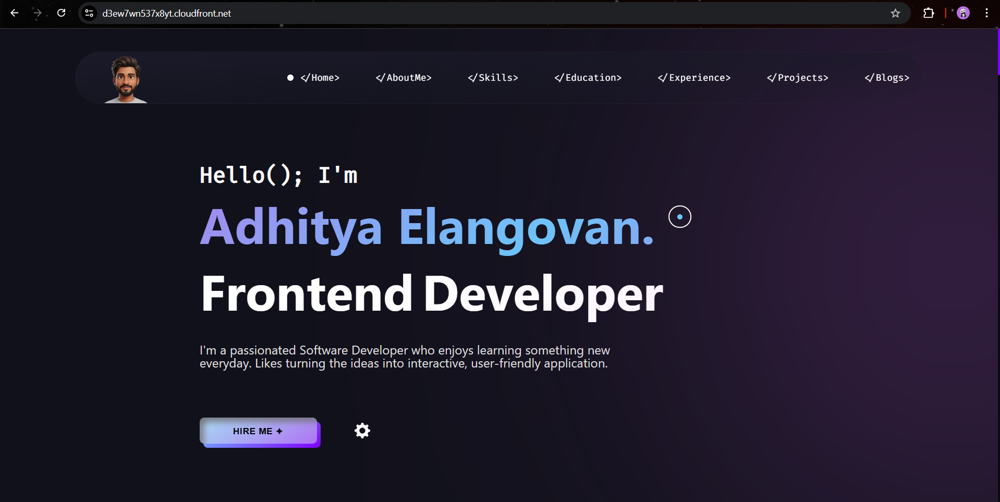

# 🌐 Portfolio Website Deployment on AWS S3

This repository contains my **personal portfolio website**, built using **HTML, CSS, and JavaScript**, and deployed on **AWS S3** with **CloudFront** for faster delivery and HTTPS support.

---

## 🔗 Live Website

👉 https://d3ew7wn537x8yt.cloudfront.net/

---

## 📁 Project Structure

```
AWS-S3-Portfolio-deployment/
│
├── index.html
├── style.css
├── main.js
├── cursorr.png
└── src/
    ├── ico/
    ├── mp3/
    ├── pdf/
    ├── png/
    ├── svg/
    └── webp/
```

---

## 🛠️ Technologies Used

- HTML  
- CSS  
- JavaScript  
- AWS S3 (Static Website Hosting)  
- AWS CloudFront (CDN & HTTPS)  

---

## 🚀 Deployment Process

### Step 1: Prepare Website Files
- Created the portfolio using HTML, CSS, and JavaScript
- Ensured `index.html` is the main entry file
- Used relative paths for all assets

---

### Step 2: Create S3 Bucket
- Created an S3 bucket
- Disabled “Block all public access”
- Enabled **Static Website Hosting**
- Set `index.html` as the index document

---

### Step 3: Upload Files
- Uploaded all website files and folders to the S3 bucket
- Verified file structure after upload

---

### Step 4: Make Website Public
- Added a bucket policy to allow public read access
- Tested the S3 website endpoint

---

### Step 5: Configure CloudFront
- Created a CloudFront distribution
- Set S3 website endpoint as the origin
- Enabled HTTPS
- Set `index.html` as the default root object

---

### Step 6: Test Deployment
- Waited for CloudFront deployment to complete
- Verified website accessibility via CloudFront URL
- Tested responsiveness and asset loading

---

## 📸 Deployment Screenshots

### S3 Static Website Hosting Enabled


### CloudFront Distribution


### Live Website



---

## 📚 What I Learned

- How static websites are hosted on the cloud
- How AWS S3 works as a hosting service
- How CloudFront improves performance and security
- End-to-end deployment workflow from local files to live website
- Real-world experience with AWS services

---

## 💰 Cost Overview (Approximate)

- AWS S3: Very low cost for static storage
- CloudFront: Minimal cost for low traffic usage

This setup is cost-effective and suitable for personal projects.

---

## 📌 Notes

- This project is created for learning and practice purposes
- Not intended for commercial use
- Future updates and improvements are planned

---

## 📎 Author

**Adhitya Elangovan**  
Software Development Engineer 

---

⭐ If you find this project useful, feel free to star the repository.


